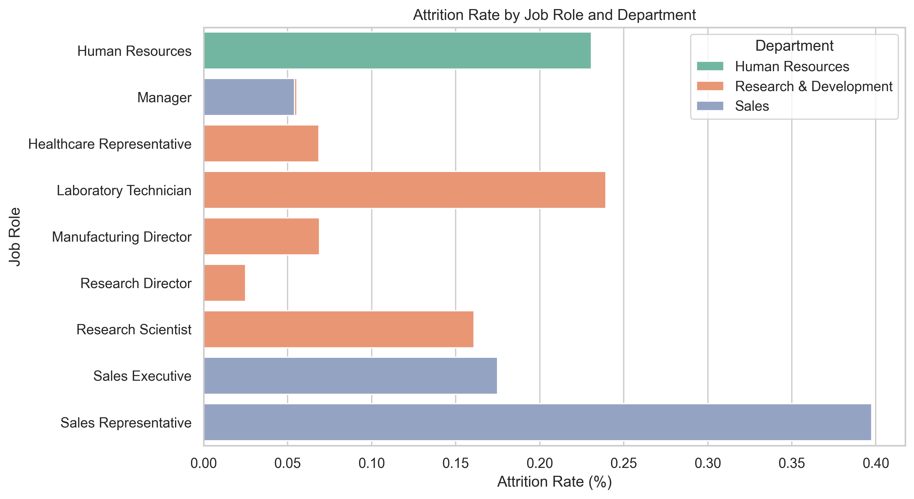

# 04 Data Analysis

This folder contains exploratory data analysis (EDA) used to uncover drivers of employee attrition and inform strategic recommendations.

---

## 📌 Purpose

To analyze trends in performance, satisfaction, and attrition using real data, and translate those insights into actionable strategy.

---

## 📄 Contents

- `exploration.ipynb` – Jupyter Notebook conducting EDA, correlation, and predictive modeling.
- `attrition_by_role_department.png` – Visualization of attrition segmented by job role and department.
- `mock_data.xlsx` – Raw HR dataset used for analysis (fictional).
- Summary markdown cells outlining insights and strategic implications.

---

## 🔍 Key Analyses Conducted

- Univariate and bivariate visualizations (e.g., Attrition vs. OverTime, Salary, Role)
- Correlation matrix of numeric fields
- Logistic regression model predicting attrition likelihood
- Segmented attrition analysis by job role and department

---

## 📸 Key Visualization

This chart highlights employee attrition trends segmented by job role and department.

---

## 🎯 Strategic Findings

- **Sales Representatives** and **Lab Technicians** exhibit the highest attrition rates (~24–40%).
- **HR Professionals** also show elevated attrition, suggesting department-specific challenges.
- Roles like **Managers** and **Research Directors** show notably low attrition, pointing to stronger engagement or support systems.
- **Predictive modeling** confirms that **OverTime**, **Job Satisfaction**, and **Years at Company** are top attrition predictors.

---

## 💡 Strategic Implications

- Prioritize retention efforts for high-risk roles such as Sales and Lab Technicians.
- Investigate compensation, workload, and management practices in departments with elevated attrition.
- Leverage insights from low-attrition roles to replicate best practices across teams.

---

> 📢 **Note:** This dataset is entirely fictional and used solely for demonstration purposes.
