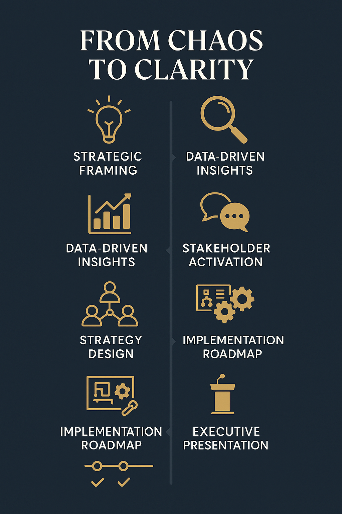

# 🚀 Strategy Execution Toolkit

This folder represents the bridge from strategy design to operational execution. It translates insights and recommendations into clear, accountable action — with timelines, ownership, and success metrics aligned for maximum impact.

---

## 🎯 Purpose

To define and activate the initiatives that address key attrition trends identified in the data analysis phase (Folder 4), and prepare for leadership communication (Folder 6).

---

## 🧭 Initiative Overview

Each initiative directly responds to patterns revealed in employee attrition and satisfaction. They’re sequenced to balance urgency, feasibility, and strategic alignment — across HR, leadership, and operations.

---

## 📊 Strategy Execution Roadmap (Visual)

This visual summarizes the transformation journey from initial chaos to strategic clarity.

---

## 📄 Documents Included

| File | Description |
|------|-------------|
| `recommendations_summary.md` | Summarizes the five most impactful retention strategies based on analysis |
| `strategic_plan.md` | Outlines implementation steps for each initiative including timeline, success metrics, and ownership |
| `presentation_outline.md` | Draft structure for how these strategies will be presented to executive leadership |

---

## 🔁 Folder Linkages

- **Inputs from**: [04_Data_Analysis](../04_Data_Analysis) — attrition patterns and predictive modeling
- **Outputs to**: [06_Presentation](../06_Presentation) — stakeholder-facing story and impact narrative

---

## ✅ Outcomes

By completing this phase, we ensure:
- A practical, action-oriented plan is in place
- Leaders are aligned and prepared to execute
- Communication materials reflect real analysis and recommendations
