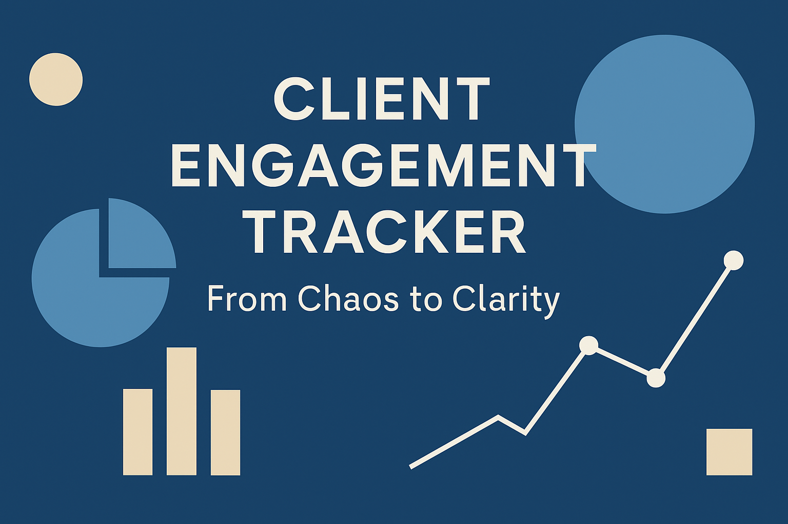

# Client Strategy Engagement: Scaling Operations with Data-Driven Process Design  
**From Chaos to Clarity**

This repository showcases a simulated consulting engagement modeled on real-world strategy challenges faced by professional services firms undergoing rapid growth. It is designed to demonstrate practical expertise across business analysis, project management, and data-driven storytelling — using tools like Excel, Power BI, and SQL to bridge strategy and execution.

---

## 🧭 Project Overview

### Client Context
The client is a mid-sized professional services firm seeking to scale its delivery operations while maintaining excellence in service quality and employee engagement. Recent growth has outpaced their internal processes, resulting in operational ambiguity, inconsistent decision-making, and unclear accountability across teams.

### Business Problem
The client has no unified framework for assigning ownership of processes or measuring performance across delivery teams. Strategic priorities are misaligned with day-to-day execution, leading to inefficiencies and lost opportunities. Leadership is looking for a solution that can diagnose current-state challenges and provide a roadmap for scalable operational improvement.

---

## 🎯 Project Objectives

- **Diagnose root causes** of inefficiencies using qualitative and quantitative frameworks (e.g., 5 Whys, stakeholder analysis).
- **Clarify ownership and accountability** through RACI modeling and process mapping.
- **Use data analysis** to simulate performance baselines and identify optimization opportunities.
- **Design a scalable operating model** that aligns people, process, and priorities.
- **Deliver insights and recommendations** in executive-friendly formats.

---

## 📦 Deliverables

- 📄 `problem_statement.md` — Engagement summary, client goals, and scope.
- 📊 `raci_matrix.xlsx` — Role clarity through a responsibility matrix.
- 📈 `mock_data.xlsx` — Simulated operational metrics for performance analysis.
- 🗺️ `stakeholder_map.pdf` — Visualization of influence and impact across teams.
- 🧩 `strategic_summary.pptx` — Executive-style presentation of findings and recommendations.

---

## 🔧 Tools & Techniques

- **Excel** – Data modeling, pivot tables, and operational dashboards
- **Power BI** – Interactive visualizations (planned)
- **SQL** – Data querying (future enhancement)
- **Markdown & GitHub** – Documentation and version control
- **PMP Tools** – Gantt charts, RACI matrix, stakeholder mapping
- **Consulting Frameworks** – 5 Whys, Current vs. Future State, Root Cause Trees

---

## 🧠 Key Skills Demonstrated

- Strategic Thinking & Structured Problem Solving  
- Operational Design & Change Management  
- Data Interpretation & Storytelling  
- Stakeholder Communication & Executive Reporting  
- Project Planning & Governance Methodologies

---

## 📁 Folder Structure

```bash
├── /client_case/              # Core case study files and outputs
│   ├── problem_statement.md
│   ├── raci_matrix.xlsx
│   ├── mock_data.xlsx
│   ├── stakeholder_map.pdf
│   └── strategic_summary.pptx

├── /data/                     # Supporting or raw datasets
├── /docs/                     # Background research or templates
├── /scripts/                  # SQL queries or automation scripts (optional)
├── /notebooks/                # Jupyter notebooks for analytics (optional)
└── README.md

